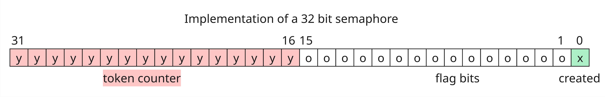

# Implementing semaphore in a bare-metal Aarch64 environnment for RaspberryPi 3 !

Adding semaphores to the mini-OS previously used to learn how OSes work.

## Goal 

## V1 : Using syscalls

### Semaphores operations

The semaphores are base on two main operations : P and V.
 - The P operation allows a process to take a token from the semaphore. If a token is available, the process can immediatly take it and enter the critical section. In the opposite, if there is no token available, the process will enters a blocked state until a new token is released. 
 - Once a process wants to leave the critical section, it can call the V operation which will release the token. 

In addition to the P and V operations, we also need to implement 2 more functions to create and delete semaphores. 

[side note] In the user process, the semaphores needs to be initialized before the creation of the childs process in order for them to access it. 

We decided to implement all of those new operations in a new [sem.c](/src/lesson06/src/sem.c) file. 

#### How are semaphores implemented ?

Before explaining the implementation of the different operations, you may first need to understand how we implemented the semaphore system. As the users can create multiple semaphore, we decided to allocate an entire kernel page dedicated to the semaphores. This page will contains all the 32-bits long semaphores created. A semaphore is organized as such :



The 16 most significant bits are used to store the counter. Each time a token is seized, the counter decrements until reaching 0 (the 16 MSB are equals to 0). The other bits ( 16 LSB bits) are used as flags to provide information on the specific semaphore. Currently, only the bit 0 is used to indicate weither the semaphore as been created or not (0 means that the slot is free, and 1 means that this is an active semaphore).

To allocate the page containing all the semaphores, we simply created a function called ```sem_table_init``` that calls upon ```allocate_kernel_page``` to retrieve a page. This page is stored as a global variable accessible by each semaphore operation. 

````c
unsigned long sem_page;

void sem_table_init() {
    sem_page = allocate_kernel_page(); // already zeroed
}
````

Finally, to retrieve the 32 bits associated with a specific semaphore, we created a macro called SEM : 

````c
#define SEM(s) * (unsigned long*) ( sem_page + s*32) //return the content of the semaphore number s
````

#### Creating a semaphore 

The creation of a semaphore is quite straitfoward. It only requires the number of token associated with the semaphore, ans returns the index associated with the newly created one. 

```c
unsigned long sem_new(unsigned int count) {
    disable_irq();
    unsigned long sem = 0;
    while ((SEM(sem)) % 2) {
        sem++;
    }
    SEM(sem) = count << 16 | 1 ;
    enable_irq(); 
    return sem;
}
 ```

A first thing to note is that we disable the interruptions during every semaphore operations. We did it to prevent any unexpected context switch during the operations, as they are considered critical sections. Then, we parkour the page until finding a semaphore slot that is free -- meaning that its bit 0 is equal to 0. Once a free slot is found at index ```sem```, we can initialize its counter with the number of token available and set its bit 0 to 1 in order to mark it as a "used slot". Finally, we enable the interruptions again before returning the newly created semaphore. 

#### Delecting a semaphore

The delection of a semaphore doesn't break 3 duck's legs. We simply set the given semaphore with the value 0. Consequently, when searching for free slots, this semaphore's slot will be available for purchase. 

```c
void sem_delete(unsigned long sem) {
    disable_irq();
    SEM(sem) = 0;
    enable_irq();
}
 ```
#### Taking a token


In order to take a token from the given semaphore, we first need to confirm weither this semaphore as any token left of not. If it does, then its counter is reduced by 1, the functions returns and the process continues running in the critical section. On the other hands, if there is no token available, the current process is blocked.
```c
 void sem_p(unsigned long sem) {
    if (SEM(sem) >> 16) {
        disable_irq();
        SEM(sem) -= 1 << 16;
        enable_irq();
    }
    else
        block(sem);
}
 ```

 #### Blocking and Unblocking a Task

 In order to block a process, a feature as already been implemented in the scheduler : it only gives the CPU to tasks with the ```TASK_RUNNING``` state. Therefore, in order to block a task, we need to create a personalized state which we decided to call ```TASK_BLOCKED```. This state is added along the other possible states in the file [sched.h](/src/lesson06/src/sched.h) :

 ```c
#define TASK_RUNNING			0
#define TASK_ZOMBIE				1
#define TASK_BLOCKED			2
 ```

Finally, it is time to show how we implement the blocking operation : 
```c
 void block(unsigned long sem) {
    disable_irq();
    current->state = TASK_BLOCKED;
    current->blocked_by = sem;
    enable_irq();
    schedule();
}
```
One thing we did not mentioned yet was how to unblock a task once a new token is available. We had multiple options available : 
 - Using an array to memorize the tasks that are waiting for a same semaphore token. In that case, once a token is released, we would unblock the first task of the array and give it the newly released token. 
 - Each blocked task memorize which semaphore it is waiting for. We give the scheduler the role of checking weither a blocked task can be unblocked or not.  

As you can see in the code above, we decided to implement the second option. This option seemed more convenient as it only requires adding a new field to the ```task_struct```. Moreover, the first solution would have come with all the problems regarding managing the size of the array and inserting, removing tasks from it. To implement the second solution, we set the blocked task in a ```TASK_BLOCKED ``` state and set a new task field ```blocked_by``` with the the identifier of the semaphore.  

The following sections explains the steps required to modify the ```task_struct``` in the  [sched.h](/src/lesson06/src/sched.h) file :  

```c
struct task_struct {
	struct cpu_context cpu_context;
	long state;
	long counter;
	long priority;
	long preempt_count;
	unsigned long blocked_by; // new line added !
	unsigned long flags;
	struct mm_struct mm;
};
```

The place were the new field ```blocked_by``` is added in ```task_struct``` is very important because it is used to set its default value : 

```c
/* state etc */	 0,0,15, 0, -1,  PF_KTHREAD, \
```

Here, we added a '-1' for the default value of ```blocked_by```, meaning that any new task is not blocked by anything yet.  
Finally, moving forward with our decision, we slightly modified the scheduler in order to see if a task is blocked, and unblock it if the associated semaphore as a token available : 

```c
void _schedule(void)
{
	preempt_disable();
	int next,c;
	struct task_struct * p;
	while (1) {
		c = -1;
		next = 0;
		for (int i = 0; i < NR_TASKS; i++){
			p = task[i];
			if (p && p->state == TASK_RUNNING && p->counter > c) {
				c = p->counter;
				next = i;
			}
            /* new condition : we test if the task is BLOCKED and if its associated semaphore has available tokens */
			else if (p && p->state == TASK_BLOCKED && sem_count(p->blocked_by) > 0) {
                // we take the token
                sem_p(p->blocked_by);
                //we unblock the task
				p->state = TASK_RUNNING;
            }
		}
		if (c) {
			break;
		}
		for (int i = 0; i < NR_TASKS; i++) {
			p = task[i];
			if (p) {
				p->counter = (p->counter >> 1) + p->priority;
			}
		}
	}
	switch_to(task[next]);
	preempt_enable();
}

```
With this modification, if a blocked task can be unblocked, its state becomes ```TASK_RUNNING``` and it can consequently be selected in the next search loop of the scheduler :) 

#### Releasing a token

With the unblocking operation already implemented in the scheduler, the release of a semaphore token is quite simple and only requires adding 1 to the semaphore's counter : 

 ```c
 void sem_v(unsigned long sem) {
    disable_irq();
    SEM(sem) += 1 << 16;
    enable_irq();
}
 ```
### Creating new syscalls

As of now, we only implemented functions that are available in a kernel space. However, our final goal is to have them available in different user processes. Therefore, to make them accessible from a user environnment, the first version of this project uses ```syscalls```.  
Consequently, 4 new syscalls needs to be added to our bare-metal environnment : 
 - ```sys_sem_new``` : Creates a new semaphore
 - ```sys_sem_p``` : Takes a semaphore token 
 - ```sys_sem_v``` : Releases a semaphore token
 - ```sys_sem_delete``` : Deletes a semaphore 

Those new syscalls are implemented along the ```sys_write```, ```sys_exit```, and ```sys_fork``` already implemented in the [sys.c](/src/lesson06/src/sys.c) file. Their implementation is nothing extravagant, as they simply call the semaphore functions defined in the [sem.c](/src/lesson06/src/sem.c) file.

 ```c
unsigned long sys_sem_new(unsigned int count){
	sem_new(count);
}
void sys_sem_p(semaphore sem){
	sem_p(sem);
}
void sys_sem_v(semaphore sem){
	sem_v(sem);
}
void sys_sem_delete(semaphore sem){
	sem_delete(sem);
}
 ```

Still in the [sys.c](/src/lesson06/src/sys.c) file, we added them to the ```sys_call_table``` : 

 ```c
void *const sys_call_table[] = {sys_write, sys_fork,  sys_exit, 
                                sys_sem_new, sys_sem_delete, sys_sem_p, sys_sem_v}; // the new syscalls added
 ```

For the user to reach those syscalls, a privilege escalation is required. The functions in charge of doing it are declared in the [user_sys.h](/src/lesson06/include/user_sys.h) file and implemented in the [user_sys.S](/src/lesson06/src/user_sys.S) file. In the [user_sys.S](/src/lesson06/src/user_sys.S) file, we implemented a function for each associated syscall : 

 ```assembly

 .globl call_sys_sem_new
call_sys_sem_new:
	mov w8, #SYS_SEM_NEW_NUMBER
	svc #0
	ret

.globl call_sys_sem_delete
call_sys_sem_delete:
	mov w8, #SYS_SEM_DELETE_NUMBER
	svc #0
	ret

.globl call_sys_sem_P
call_sys_sem_P:
	mov w8, #SYS_SEM_P_NUMBER
	svc #0
	ret

.globl call_sys_sem_V
call_sys_sem_V:
	mov w8, #SYS_SEM_V_NUMBER
	svc #0
	ret
 ```
Those funcions will execute a synchronous interruption after defining in w8 the id of the syscall to execute. The id here represents the index of the syscall function in the ```sys_call_table``` showed above. The ids were defined as such at the start of the [user_sys.S](/src/lesson06/src/user_sys.S) file: 

 ```assembly
.set SYS_SEM_NEW_NUMBER, 3
.set SYS_SEM_DELETE_NUMBER, 4
.set SYS_SEM_P_NUMBER, 5
.set SYS_SEM_V_NUMBER, 6
```

A last thing to do for the syscalls to work correctly is to increment the ```__NR_syscalls``` constant in the [sys.h](/src/lesson06/include/sys.h) file. This number needs to represent the exact number of syscalls added to the ```sys_call_table```.

```c
#define __NR_syscalls	 7

```

Finally, every function created was declared in its associated header file. We consequently modified the [sys.h](/src/lesson06/include/sys.h), [user_sys.h](/src/lesson06/include/user_sys.h), and [sem.h](/src/lesson06/include/sem.h) files to add the newly created functions.

### Testing 

Now that everything is implemented, we need to test it in order to ensure that the new code is working correctly. We decided to take two different approaches for the test : 

 - Static tests : we disable the preemption of the tasks, and create a new syscall to make them decide when to release the CPU. This method is usefull to be in control of which task has the CPU, and consequently be sure that the tasks are blocked as they should be.
 - Dynamic tests : for those tests, the preempton is enable for the tasks, and the scenario will be more realistic but less deterministic. Those tests are adapted to the main code as there is no modification added to disable the interruption switching.

#### 1 task and 1 semaphore 1 token

The first test we did is made of only one task and one semaphore. We first wanted to test weither a task can create a semaphore, take a token, enter the critical section and then release it. 

#### 2 task and 1 semaphore 1 token

The second test ensure that if a task is asking for a token and there is not token available, then this task will be blocked until the token is released. We can also adapt this test and give two tokens to the semaphore to ensure that both tasks can take it without being blocked.

#### 3 task and 1 semaphore 2 token

A test a little more complicated than the previous one.

#### 4 task and 2 semaphore , 1 and 2 tokens

This test is made to ensure that taking and releasing a token from a semaphore will not affect the other semaphores. 

## V2 : Using Futex

Por 

# Acknowledgements

- Sergey Matyukevich, Alexandre Venito et al. made the educational kernel and most of the resources in https://github.com/s-matyukevich/raspberry-pi-os
- Felix Xiaozhu Lin et al. adapted the codebase to make it work on QEMU and improved the content in https://github.com/fxlin/p1-kernel
- Millian Poquet adapted the codebase for his operating system design course in https://github.com/mpoquet/raspberry-pi-os-qemu
